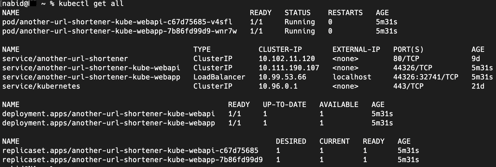

# Another URL Shortener

In this project I am designing a URL shortener Web API using .NET 5, REST API, Postgres and Redis. This application is deployable separately as a standalone service using Docker and Kubernetes (they both are mutually exclusive, keeping both as example for new learners). I have used following architecture and patterns so to say:
* Request driven architecture
* Repository pattern
* Dependency injection
* Self registered services with scoped lifetime
* Request handling by services
* Code first approach
* Persistent object
* Docker/Kubernetes

[](https://github.com/Nabid/Another-URL-Shortener/actions/workflows/dotnet.yml) [](https://github.com/Nabid/Another-URL-Shortener/actions/workflows/codeql-analysis.yml)

Note: updating... the project is ongoing and let's say 95% finished. Next todo includes verify unique shortened key.

***Note:*** this is neither production ready, nor configured to run in live servers. For example: postgres security, encryption etc. are not included.

## System details
|product|version|
|-|-|
|MacOS|Ventura 13.0.1|
|Visual Studio|2022|
|Visual Studio Code|1.73.1|
|.NET|5.0|
|dotnet|5.0.400|
|dotnet ef|6.0.3|
|PostgreSQL|12.0|
|Docker desktop|20.10.21|
|Kubernetes|1.25.1|

## Configure and run
### Step 1: setup Entity Framework and code-first
* Install ```dotnet-ef``` if needed, check [documentation](https://learn.microsoft.com/en-us/ef/core/cli/dotnet).
* Create ef migration: ```dotnet ef migrations add InitialCreate```. In this branch, `InitialCreate` has been already created, check `Migrations` directory.
* Then apply the database (double check connection string): ```dotnet ef database update```
* Update schema (if changed after creation): ```dotnet ef database update 0```
* Drop the migration: ```dotnet ef migrations remove```

### Step 2: build the solution
From root directory where `.sln` is located (add ```--project "Another URL Shortener"``` suffix in following commands) or from `Another URL Shortener` where `.csproj` is located:
* ```dotnet build```
* ```dotnet restore```
* ```dotnet run```

Request to: https://localhost:5001/api/ShortUrls/

### Step 3: docker steps
#### Prepare Docker desktop
* Create Dockerfile and .dockerignore (already created)

#### Prepare Postgres
* Update Postgres configuration `pg_hba.conf` to accept all requests:
`host    all             all             192.168.0.127/0         trust`
\***
* and update Postgres configuration `postgresql.conf` to listen on all addresses:
`listen_addresses = '*'` \***
* Then restart Postgres service
* Correct `ConnectionStrings`: update host address in `DockerAppLocalSql`
* Add `DockerAppLocalSql` in `Startup.cs`

*** Reference: [Stackoverflow](https://stackoverflow.com/a/31249288/3731282), [thegeekstuff](https://www.thegeekstuff.com/2014/02/enable-remote-postgresql-connection/)

#### docker build commands
From `/docker/` directory execute following commands:
1. ```docker build -t another-url-shortener-image -f Dockerfile ../Another\ URL\ Shortener```
2. THIS:
    1. ```docker create -p 44326:80 --name another-url-shortener-container another-url-shortener-image```
    2. ```docker start another-url-shortener-container```
3. OR THIS ```docker run -rm -p 44326:80 another-url-shortener-image```

Request to: http://localhost:44326/api/ShortUrls/

### Step 4: deploy via Kubernetes
* 'Prepare Postgres' step needed.
* Docker image build needed.
* Create Kubernetes deploy services (already created in `/docker/deploy-webapi.yml` and `/docker/deploy-webapp.yml`)
* Execute from `/docker/` directory: `kubectl apply -f ./`
* Run ` kubectl get all` and make sure the `another-url-shortener-kube-webapi` (Service) and `another-url-shortener-kube-webapp` (Load Balancer) are running:



Request to: http://localhost:44326/api/ShortUrls/

More details at [Microsoft documentation](https://learn.microsoft.com/en-us/dotnet/architecture/containerized-lifecycle/design-develop-containerized-apps/build-aspnet-core-applications-linux-containers-aks-kubernetes).

## Troubleshoot
### Unable to start Kestrel
Environment: MacOS, VS Code
`crit: Microsoft.AspNetCore.Server.Kestrel[0]`
System.InvalidOperationException: Unable to configure HTTPS endpoint. No server certificate was specified, and the default developer certificate could not be found or is out of date.
To generate a developer certificate run 'dotnet dev-certs https'. To trust the certificate (Windows and macOS only) run 'dotnet dev-certs https --trust'.
For more information on configuring HTTPS see https://go.microsoft.com/fwlink/?linkid=848054.

### error from sender: invalid excludepatterns: [bin\ obj\]: syntax error in pattern
Change "\" to "/" in `.dockerignore` file.
